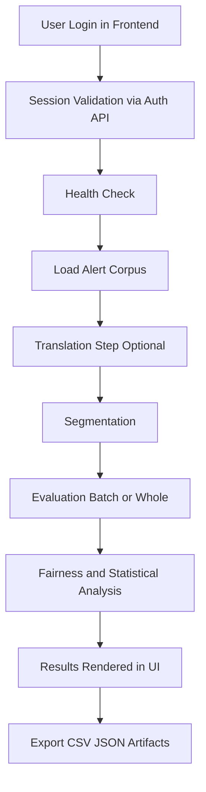

# IPAWS Application Architecture & Functionality

This document describes the full architecture and runtime behavior of the IPAWS application stack, including backend (FastAPI + research pipeline) and frontend (React + Vite).

## 1) System Overview

The application has two primary layers:

- **Backend API**: FastAPI service in `api/main.py`, exposing endpoints for alert retrieval, translation, segmentation, fairness evaluation, human scoring, template generation, authentication, and admin analytics.
- **Frontend UI**: React SPA in `web/src/App.jsx`, providing workflows for Health, Alerts, Single Eval, Human Eval, Batch Eval, Whole Eval, and an admin-only analytics dashboard.

Supporting layer:

- **Research Core** (`ipaws_research/*`): domain modules for translation engines, segmentation, fairness scoring, statistics, visualization, and pipeline orchestration via LangGraph.

## 2) Repository Architecture

### Backend/API

- `api/main.py`
  - FastAPI app bootstrapping
  - CORS middleware
  - request/response models
  - authentication/session endpoints
  - admin analytics aggregation endpoint
  - IPAWS functional endpoints
  - optional static frontend serving when `web/dist` exists

### Research Core

- `ipaws_research/workflow.py`
  - LangGraph state machine orchestration (`retrieve_alerts -> translate -> segment -> evaluate -> aggregate -> analyze -> report`)
- `ipaws_research/agents.py`
  - pipeline node implementations
- `ipaws_research/alert_retrieval.py`
  - FEMA Open API retrieval and normalization
- `ipaws_research/translations.py`
  - GPT-4o, GPT-5.5, Google NMT, Replicate Llama 3, offline fallback
- `ipaws_research/segmentation.py`
  - segment extraction + communicative function labeling
- `ipaws_research/evaluation.py`
  - fairness scoring logic
- `ipaws_research/stats.py`
  - hypothesis testing
- `ipaws_research/visualization.py`
  - chart artifact generation
- `ipaws_research/export.py`
  - CSV export

### Frontend

- `web/src/App.jsx`
  - all major screens/components
  - login/session gate
  - role-based tab visibility
  - admin analytics dashboard with charts and statistical summaries
  - translation/evaluation UX for batch + whole flows
- `web/src/App.css`
  - full-width layout, left rail navigation, dashboard/table/chart styles

## 3) Backend Architecture

## 3.1 API Boot and Runtime

- Loads environment from project `.env` via `python-dotenv`.
- Enables permissive CORS (`allow_origins=["*"]`) for browser clients.
- Uses in-memory stores for:
  - `CURRENT_STATE`: latest pipeline output snapshot
  - `SESSIONS`: auth tokens with expiry

## 3.2 Authentication & Session Model

### Endpoints

- `POST /auth/login`
  - Input: `username`, `password`, `role` (`user`|`admin`)
  - Validates password from env vars:
    - admin: `APP_ADMIN_PASSWORD` (or `ADMIN_PASSWORD` fallback)
    - user: `APP_USER_PASSWORD` (falls back to admin password if unset)
  - Creates session token + expiry
  - Returns: token + role + username + expiry

- `GET /auth/session`
  - Requires `Authorization: Bearer <token>`
  - Validates token existence and TTL
  - Returns session status and identity

### Session behavior

- Default TTL: `SESSION_TTL_SECONDS=28800` (8 hours)
- Expired tokens are removed lazily when validated.
- Session storage is in-process memory (not durable across service restarts/revisions).

## 3.3 Functional Endpoints

- `GET /health` — service health and server time
- `GET /config` — selected runtime config visibility
- `GET /admin/analysis` — admin-only analytics summary for submitted human scores and composite exports
- `GET /alerts` — stratified/sample retrieval from FEMA Open API with filters
- `POST /translate` — translation by selected system (`gpt4o`, `gpt5.5`, `google_nmt`, `llama3`)
- `POST /segment` — source segmentation
- `POST /evaluate` — automated fairness scoring
- `POST /evaluate/human` — persists human scores to CSV
- `POST /pipeline/run` — end-to-end research workflow execution
- `POST /templates/build` — template extraction and save

## 3.4 Data Persistence

- Main outputs in `/outputs`:
  - fairness/human scores, segment outputs, composite/statistical results
- Human evaluation appends rows to `outputs/human_fairness_scores.csv`.
- Admin analytics reads from `outputs/human_fairness_scores.csv` and `outputs/composite_scores.csv` to build dashboard summaries.
- Session and current-state caches are in memory (non-persistent).

## 3.5 Admin Analytics Model

The admin analytics endpoint aggregates persisted evaluation data into BI-style summaries for the frontend dashboard.

### Human evaluation analytics

- Total submissions
- Unique message count
- Named evaluator count
- Average human score across all 12 fairness dimensions
- Language-level score and submission breakdowns
- Metric-level averages for all `PF*` and `IF*` dimensions
- Daily submission trend
- Recent submissions preview table
- Normal distribution overlay for average human score percentages

### Composite export analytics

- OFS / PFI / IFI averages by language and translation system
- Best-performing system by language
- System rankings across the full export set
- Two-way ANOVA on `OFS` with factors:
  - `language`
  - `system`
  - `language × system` interaction

### Access control

- `GET /admin/analysis` requires a valid bearer token for an `admin` session.
- Non-admin sessions receive `403 Insufficient permissions`.

## 4) Frontend Architecture

## 4.1 Shell and Navigation

- SPA rendered by `App.jsx`.
- Header contains theme toggle + logout.
- Main shell now uses the full available canvas width.
- Sidebar is rendered as a sticky left rail aligned to the far left of the app layout.
- Left navigation tabs are role-aware:
  - **Admin**: all tabs, including `Admin Analytics`
  - **User**: subset excluding admin-only page(s) (currently hides Human Eval tab)

## 4.2 Login Gate

Before app content is shown:

1. Login form submits to `POST /auth/login`.
2. On success, session token is stored in `sessionStorage`.
3. App validates token via `GET /auth/session` on startup.
4. If invalid or expired, user is returned to login screen.

Wrong password = login failure, app pages remain inaccessible.

## 4.3 Major UI Functional Areas

- **Health**: backend reachability + timestamp
- **Alerts**: sortable/filterable table + visual distributions
- **Single Eval**: direct translation/evaluation for one message
- **Human Eval**: manual scoring and rationale capture
- **Batch Eval**:
  - alert iteration with Back/Next
  - optional segmentation mode
  - compare mode for source vs translation panes
  - loading indicators and context strip
- **Whole Eval**:
  - side pane for metadata/load controls
  - main pane for translation/evaluation workflow
  - compare mode + loading indicators
- **Admin Analytics**:
  - KPI summary cards
  - submission trend line chart
  - human language coverage chart
  - fairness metric performance chart
  - composite OFS chart by language and system
  - normal distribution curve for human average scores
  - two-way ANOVA table and significance insights
  - evaluator activity and recent submission tables

## 4.3.1 Analytics Dashboard Reference

The `Admin Analytics` page is intended for admin users who need a BI-style summary of submitted review data.

### Access

1. Sign in with role `Admin`.
2. Open the `Admin Analytics` tab from the left navigation rail.
3. The frontend calls `GET /admin/analysis` using the active bearer token.

### Data sources

- `outputs/human_fairness_scores.csv`
  - source for human-evaluation submissions, fairness metrics, evaluator activity, and score distributions
- `outputs/composite_scores.csv`
  - source for composite score benchmarking, system comparisons, and ANOVA analysis

### Dashboard sections

- **Analytics Page Guide**
  - embedded documentation explaining the purpose of each chart and the interpretation of the statistical outputs
- **KPI cards**
  - total submissions
  - unique messages
  - named evaluators
  - composite record count
- **Submission Trend**
  - daily counts of submitted human evaluations
- **Human Evaluation Coverage**
  - language distribution of submitted evaluations
- **Metric Performance**
  - average score by the 12 fairness dimensions (`PF1–PF6`, `IF1–IF6`)
- **Composite OFS by Language & System**
  - average `OFS` comparison across translation systems for each language
- **Normal Distribution Curve**
  - observed distribution of average human scores compared against a fitted normal curve
- **Two-Way ANOVA**
  - significance testing for `OFS` by:
    - `language`
    - `system`
    - `language × system`
- **Evaluator Activity**
  - evaluator participation counts and average scores
- **Recent Human Submissions**
  - latest saved rows with evaluator, language, score, and notes preview

### Statistical interpretation

- **Average human score** is normalized to a percentage for easier reading in the dashboard.
- **Normal distribution curve** helps assess whether score patterns resemble a bell-shaped distribution or show skew/clustering.
- **Two-way ANOVA** reports:
  - `F` statistic
  - `p-value`
  - partial effect size
  - percent variance explained
- A `p-value < 0.05` is typically interpreted as statistically significant in this dashboard.

## 4.4 UX Behavior Patterns

- Role-based access and nav filtering
- Full-width dashboard presentation for analysis-heavy screens
- Collapsible panes for space savings
- Bottom navigation for message traversal
- Auto-selection and synchronization between list selection and active item
- Inline loading spinners for alerts/segmenting/translation states

## 5) End-to-End Flows

## 5.1 Authentication Flow

1. User submits role + username + password.
2. Backend validates password against role config.
3. Backend returns token with expiry.
4. Frontend stores token in session storage.
5. Frontend validates token on app load.

Admin users use the same session token to call `GET /admin/analysis` from the analytics dashboard.

## 5.2 Translation/Evaluation Flow (Batch/Whole)

1. User loads alerts (`/alerts`).
2. Active message selected from table.
3. Translation requested (`/translate`).
4. Optional fairness scoring requested (`/evaluate`).
5. Optional human scoring saved (`/evaluate/human`).

## 5.3 Admin Analytics Flow

1. Admin signs in via `POST /auth/login`.
2. Frontend stores the bearer token in `sessionStorage`.
3. Admin opens the `Admin Analytics` tab.
4. Frontend requests `GET /admin/analysis` with the bearer token.
5. Backend reads output CSVs, computes summaries/statistics, and returns a dashboard payload.
6. Frontend renders charts, tables, normal-curve distribution, and ANOVA results.

## 5.4 Pipeline Flow

1. User/automation calls `/pipeline/run`.
2. LangGraph executes agents in sequence.
3. Scores/composites/stats/charts generated.
4. Results exported to `/outputs`.

## 5.5 How Each Step Works

### A) Login and token issuance
- **Trigger**: user submits credentials from frontend login form.
- **Endpoint**: `POST /auth/login`.
- **Processing**: backend validates role-specific password from environment variables and creates an expiring session token.
- **Output**: bearer token, role, username, expiry.
- **Failure behavior**: invalid credentials return `401`.

### B) Session validation on app load
- **Trigger**: app startup/refresh.
- **Endpoint**: `GET /auth/session`.
- **Processing**: backend checks token existence and TTL in in-memory session store.
- **Output**: session validity + identity.
- **Failure behavior**: expired/invalid token forces relogin.

### C) System readiness check
- **Trigger**: user opens Health page.
- **Endpoint**: `GET /health`.
- **Processing**: lightweight service liveness/status check.
- **Output**: status + server timestamp.
- **Failure behavior**: UI should block/avoid analytical runs until healthy.

### D) Alert retrieval
- **Trigger**: user requests a sample or filtered corpus.
- **Endpoint**: `GET /alerts`.
- **Processing**: retrieves alert records from FEMA API and normalizes fields for UI and downstream modules.
- **Output**: alert list for navigation and selection.
- **Failure behavior**: empty or failed upstream fetch yields no corpus for analysis.

### E) Translation execution
- **Trigger**: user requests translation for active alert/message.
- **Endpoint**: `POST /translate`.
- **Processing**: dispatches to selected translation backend (`gpt4o`, `gpt5.5`, `google_nmt`, `llama3`) with configured credentials/model.
- **Output**: translated text payload.
- **Failure behavior**: provider/auth/model issues return translation errors.

### F) Segmentation
- **Trigger**: user requests segmentation.
- **Endpoint**: `POST /segment`.
- **Processing**: segmentation module partitions text into smaller units and labels communicative function where applicable.
- **Output**: ordered segment list for evaluation.
- **Failure behavior**: low-quality/empty input can yield weak or empty segmentation.

### G) Automated scoring
- **Trigger**: user runs model-based evaluation.
- **Endpoint**: `POST /evaluate`.
- **Processing**: fairness/quality scoring logic computes metric values from source/translation context.
- **Output**: structured metric scores used by UI and analytics.
- **Failure behavior**: incomplete payload/context returns validation or processing errors.

### H) Human scoring persistence
- **Trigger**: evaluator submits manual rubric scores.
- **Endpoint**: `POST /evaluate/human`.
- **Processing**: server validates and appends submission row to persisted CSV.
- **Output**: stored human-evaluation record.
- **Failure behavior**: malformed values or file-write issues prevent persistence.

### I) Analytics aggregation
- **Trigger**: admin opens dashboard or full pipeline run is requested.
- **Endpoints**: `GET /admin/analysis` and `POST /pipeline/run`.
- **Processing**: aggregates persisted files, computes distributions/system comparisons, and statistical tests (including ANOVA where applicable).
- **Output**: dashboard-ready analytics payload and derived artifacts.
- **Failure behavior**: missing source files or sparse data can produce partial/empty sections.

### J) Export
- **Trigger**: pipeline/reporting stage completion.
- **Module path**: export/statistics/visualization utilities in `ipaws_research/*`.
- **Processing**: writes CSV/JSON/chart artifacts to `outputs/`.
- **Output**: reproducible files for external notebooks, papers, and appendices.
- **Failure behavior**: interrupted runs can leave partial output sets.

## 6) Deployment Architecture

## 6.1 Frontend

- Built by Vite (`web/dist`).
- Deployed to Firebase Hosting.
- Uses `VITE_API_BASE_URL` for backend target in production.
- In local development, Vite proxies `/auth`, `/admin`, `/alerts`, `/translate`, `/evaluate`, `/templates`, `/pipeline`, `/health`, and `/config` to the backend.

## 6.2 Backend

- Deployed on Cloud Run (`ipaws-api`).
- Runtime env vars control auth, model, and behavior:
  - `APP_ADMIN_PASSWORD`
  - `APP_USER_PASSWORD` (optional)
  - `SESSION_TTL_SECONDS`
  - `OPENAI_API_KEY`
  - `OPENAI_MODEL`
  - `OFFLINE_MODE`

## 7) Security Notes

- Authentication is now backend-enforced (not frontend-only).
- Session tokens are bearer tokens stored in browser session storage.
- In-memory sessions are reset on service restarts/revisions.
- For higher assurance in production, consider:
  - external session store (Redis/Firestore)
  - hashed password management
  - HTTPS-only secure cookies instead of JS-readable tokens
  - rate limiting and login attempt throttling

## 8) Operational Notes / Current Constraints

- Some state is process-local (sessions/current pipeline state).
- A new backend revision invalidates existing in-memory sessions.
- CORS currently allows all origins.
- Admin analytics depends on local/exported CSV availability; missing files produce empty dashboard sections rather than historical warehouse-backed reporting.
- UI is implemented in a single large `App.jsx` file; future maintainability can improve by component splitting.

## 9) Recommended Next Improvements

- Split frontend into route-level/page-level components.
- Move auth/session management to dedicated hooks/context.
- Add backend session persistence and token revocation support.
- Expand admin analytics with richer benchmarking, filtering, and export controls.
- Add API integration tests for auth + translation/evaluation flows.
