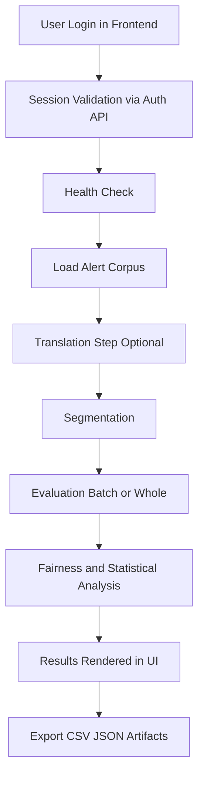

# IPAWS Application Architecture & Functionality

This document describes the full architecture and runtime behavior of the IPAWS application stack, including backend (FastAPI + research pipeline) and frontend (React + Vite).

## 1) System Overview

The application has two primary layers:

- **Backend API**: FastAPI service in `api/main.py`, exposing endpoints for alert retrieval, translation, segmentation, fairness evaluation, human scoring, submission management, template generation, Google Sign-In authentication, alert-pool curation, and admin analytics.
- **Frontend UI**: React SPA in `web/src/App.jsx`, providing workflows for Health, Alerts, Single Eval, Human Eval, Batch Eval, Whole Eval, My Submissions, Alert Pool, and an admin-only analytics dashboard.

Supporting layer:

- **Research Core** (`ipaws_research/*`): domain modules for translation engines, segmentation, fairness scoring, statistics, visualization, and pipeline orchestration via LangGraph.

## 2) Repository Architecture

### Backend/API

- `api/main.py`
  - FastAPI app bootstrapping
  - CORS middleware
  - request/response models
  - authentication/session endpoints
  - admin analytics aggregation endpoint
  - IPAWS functional endpoints
  - optional static frontend serving when `web/dist` exists

### Research Core

- `ipaws_research/workflow.py`
  - LangGraph state machine orchestration (`retrieve_alerts -> translate -> segment -> evaluate -> aggregate -> analyze -> report`)
- `ipaws_research/agents.py`
  - pipeline node implementations
- `ipaws_research/alert_retrieval.py`
  - FEMA Open API retrieval and normalization
- `ipaws_research/translations.py`
  - GPT-4o, GPT-5.5, Google NMT, Replicate Llama 3, offline fallback
- `ipaws_research/segmentation.py`
  - segment extraction + communicative function labeling
- `ipaws_research/evaluation.py`
  - fairness scoring logic
- `ipaws_research/stats.py`
  - hypothesis testing
- `ipaws_research/visualization.py`
  - chart artifact generation
- `ipaws_research/export.py`
  - CSV export

### Frontend

- `web/src/App.jsx`
  - all major screens/components
  - login/session gate
  - role-based tab visibility
  - admin analytics dashboard with charts and statistical summaries
  - translation/evaluation UX for batch + whole flows
- `web/src/App.css`
  - full-width layout, left rail navigation, dashboard/table/chart styles

## 3) Backend Architecture

## 3.1 API Boot and Runtime

- Loads environment from project `.env` via `python-dotenv`.
- Enables permissive CORS (`allow_origins=["*"]`) for browser clients.
- Uses in-memory stores for:
  - `CURRENT_STATE`: latest pipeline output snapshot
  - `SESSIONS`: auth tokens with expiry

## 3.2 Authentication & Session Model

Authentication is handled through **Google Sign-In (Firebase)**. There is no password-based login. The frontend obtains a Google ID token via Firebase Auth, and the backend verifies it and maps the account to a role and language through an email allowlist.

### Endpoints

- `POST /auth/google`
  - Input: `id_token` (Google/Firebase ID token)
  - Verifies the token server-side with `firebase-admin`
  - Requires a verified email present in the `ACCESS_ALLOWLIST`
  - Allowlist entry supplies the account's `role` (`user`|`admin`) and, for evaluators, an assigned `language` (`es`/`hi`)
  - Creates a session token + expiry
  - Returns: token + role + username + email + language + expiry
  - Rejections: missing token (`400`), no/unverified email (`401`/`403`), account not on allowlist (`403`)

- `GET /auth/session`
  - Requires `Authorization: Bearer <token>`
  - Validates token existence and TTL
  - Returns session validity and identity (role, username, email, language, expiry)

### Session behavior

- Default TTL: `SESSION_TTL_SECONDS=28800` (8 hours)
- Expired tokens are removed lazily when validated.
- Session storage is in-process memory (not durable across service restarts/revisions).
- The signed-in identity (email/username) is authoritative and is used to attribute human-evaluation submissions.

## 3.3 Functional Endpoints

- `GET /health` — service health and server time
- `GET /config` — selected runtime config visibility
- `POST /auth/google` — Google Sign-In verification and session issuance
- `GET /auth/session` — bearer-token session validation
- `GET /admin/analysis` — admin-only analytics summary for submitted human scores and composite exports
- `GET /admin/download/{dataset_key}` — admin-only CSV export download
- `GET /admin/alert-pool` — admin-only: full official candidate pool with quality, eligibility, acquisition-target, and selection status
- `POST /admin/alert-pool/expand` — admin-only: fetch required CAP categories in one California-filtered archive pass, then enforce independent 50-record eligible quotas for Weather, Evacuation/Shelter, Public Safety, and Health
- `POST /admin/alert-pool/select` — admin-only: set the 48 alerts shown to evaluators
- `GET /admin/research-corpus` — admin-only: inspect preparation and freeze status
- `POST /admin/research-corpus/prepare` — admin-only: snapshot the exact selected source corpus and declared study conditions
- `POST /admin/research-corpus/translate` — admin-only: generate and durably save the next translation batch for one system/language condition
- `POST /admin/research-corpus/review-translation` — admin-only: approve or reject one translation with reviewer identity, reason, hashes, and an optional correction
- `POST /admin/research-corpus/freeze` — admin-only: lock a complete source/translation manifest before scoring
- `GET /alerts` — alert retrieval; `?source=research` returns the admin-selected alert pool
- `POST /translate` — translation by selected system (e.g. `gemini`, `gpt4o`, `google_nmt`, `llama3`)
- `POST /segment` — source segmentation
- `POST /evaluate` — automated fairness scoring
- `POST /evaluate/human` — persists a human score row to the durable submission store (Cloud Storage JSON, or local CSV fallback; evaluator taken from session)
- `GET /submissions` — list submissions (users see own; admins see all)
- `PUT /submissions/{submission_id}` — edit a submission's scores/notes (ownership enforced)
- `DELETE /submissions/{submission_id}` — delete a submission (ownership enforced)
- `POST /pipeline/run` — end-to-end research workflow execution
- `POST /templates/build` — template extraction and save

## 3.4 Data Persistence

- Main outputs in `/outputs`:
  - fairness/human scores, segment outputs, composite/statistical results
- Human evaluation submissions are stored durably in Google Cloud Storage as a single JSON object (`submissions/human_fairness_scores.json`) when the `SUBMISSIONS_GCS_BUCKET` environment variable is set; otherwise the app falls back to `outputs/human_fairness_scores.csv` for local development.
- All submission reads/writes go through a single storage layer (`_load_submission_rows` / `_save_submission_rows` / `_append_submission_row`), so list/edit/delete operations and analytics share the same durable source. Each submission is keyed by its `timestamp`.
- On first read, if the bucket object does not yet exist it is seeded once from any shipped CSV, then all subsequent writes update the bucket object.
- Admin analytics reads the same durable submission store plus `outputs/composite_scores.csv` to build dashboard summaries.
- The official candidate pool retains eligible, flagged, excluded, and unmapped records for audit. Acquisition targets 200 strictly eligible records: 50 in each study category. Flagged records remain audit-only even after review approval and never count toward or enter the research pool. CAP mapping is `Met` to Weather, `Safety`/`Security` to Public Safety, and `Health` to Health. `Geo`/`Rescue`/`Fire` records count as Evacuation only when CAP `responseType` or explicit text indicates evacuation/shelter. Other CAP categories are not requested by pool acquisition.
- The admin-selected 48-alert subset is persisted so evaluators consistently see the same balanced corpus.
- The research corpus manifest is stored at `research-corpus/manifest-v1.json` in the configured Cloud Storage bucket, with `outputs/.research_corpus_v1.json` as the local fallback. It contains exact source and translation text, SHA-256 hashes, official identifiers, model metadata, creator/freezer identity, and timestamps.
- Generated translation text is retained as immutable provenance. Bilingual review may supply corrected scoring text without overwriting the generated artifact; every decision records reviewer identity, timestamp, reason, source hash, generated hash, effective translation hash, and transition history.
- A draft can freeze only when the current balanced 48-alert selection still matches the prepared source hash, every declared alert/system/language translation exists with valid hashes, and every translation has a current approval. Rejection blocks freeze, and regeneration resets approval while preserving audit history. A frozen manifest cannot be modified, and alert selection is locked.
- Human submissions persist the corpus ID, official alert ID, source hash, and translation hash. Scoring endpoints return `409` when inputs do not exactly match a frozen artifact.
- Session and current-state caches are in memory (non-persistent).
- **Note:** Cloud Run instances are ephemeral, so local CSV writes are not durable across revisions/restarts. Durable submission persistence therefore requires the Cloud Storage backend (`SUBMISSIONS_GCS_BUCKET`).

## 3.5 Admin Analytics Model

The admin analytics endpoint aggregates persisted evaluation data into BI-style summaries for the frontend dashboard.

### Human evaluation analytics

- Total submissions
- Unique message count
- Named evaluator count
- Average human score across all 12 fairness dimensions
- Language-level score and submission breakdowns
- Metric-level averages for all `PF*` and `IF*` dimensions
- Daily submission trend
- Recent submissions preview table
- Normal distribution overlay for average human score percentages

### Composite export analytics

- OFS / PFI / IFI averages by language and translation system
- Best-performing system by language
- System rankings across the full export set
- Two-way ANOVA on `OFS` with factors:
  - `language`
  - `system`
  - `language × system` interaction

### Access control

- `GET /admin/analysis` requires a valid bearer token for an `admin` session.
- Non-admin sessions receive `403 Insufficient permissions`.

## 4) Frontend Architecture

## 4.1 Shell and Navigation

- SPA rendered by `App.jsx`.
- Header contains theme toggle + logout.
- Main shell now uses the full available canvas width.
- Sidebar is rendered as a sticky left rail aligned to the far left of the app layout.
- Left navigation tabs are role-aware:
  - **Admin**: all tabs — `Health`, `Alerts`, `Single Eval`, `Human Eval`, `Batch Eval`, `Whole Eval`, `My Submissions`, `Alert Pool`, `Admin Analytics`
  - **User (evaluator)**: `Whole Eval` and `My Submissions` only

## 4.2 Login Gate

Before app content is shown:

1. User signs in with Google (Firebase Auth popup).
2. The frontend sends the Google ID token to `POST /auth/google`.
3. On success, the backend session token is stored in `sessionStorage`.
4. App validates the token via `GET /auth/session` on startup.
5. If invalid or expired, the user is returned to the sign-in screen.

Accounts that are not on the backend allowlist cannot access the app pages.

## 4.3 Major UI Functional Areas

- **Health**: backend reachability + timestamp
- **Alerts**: sortable/filterable table + visual distributions
- **Single Eval**: direct translation/evaluation for one message
- **Human Eval**: manual scoring and rationale capture
- **Batch Eval**:
  - alert iteration with Back/Next
  - optional segmentation mode
  - compare mode for source vs translation panes
  - loading indicators and context strip
- **Whole Eval**:
  - auto-loads the frozen research corpus (`/alerts?source=research`) on open
  - resolves the exact frozen translation for the current alert, system, and evaluator language
  - keeps frozen translation text read-only and submits corpus/alert identity with every score
  - single language selector + compare-mode toggle
  - 12-metric human scoring form and save action
  - collapsible alert picker + Back/Next traversal
- **My Submissions**:
  - lists the signed-in user's saved evaluations (admins see all)
  - search/filter, inline edit of the 12 scores + notes, and delete
  - color-coded metric rows and per-submission average
- **Alert Pool** (admin):
  - build a 200-eligible-record pool through independent 50-record category quotas
  - retain and review ineligible records without counting them toward acquisition quotas
  - select the balanced 48-record subset shown to evaluators
- **Admin Analytics**:
  - always-visible KPI summary cards
  - segmented views: **Overview**, **Human Evaluations**, **Model Performance**
  - charts and tables for trends, coverage, metric performance, composite OFS, score distribution, two-way ANOVA, evaluator activity, and recent submissions
  - collapsible "Export data" section for CSV downloads

## 4.3.1 Analytics Dashboard Reference

The `Admin Analytics` page is intended for admin users who need a BI-style summary of submitted review data.

### Access

1. Sign in with role `Admin`.
2. Open the `Admin Analytics` tab from the left navigation rail.
3. The frontend calls `GET /admin/analysis` using the active bearer token.

### Data sources

- `outputs/human_fairness_scores.csv`
  - source for human-evaluation submissions, fairness metrics, evaluator activity, and score distributions
- `outputs/composite_scores.csv`
  - source for composite score benchmarking, system comparisons, and ANOVA analysis

### Layout

The page opens with a row of KPI cards that stay visible, followed by a segmented control that switches between three focused views (progressive disclosure to reduce on-screen density):

- **Overview** — submission trend and language coverage charts
- **Human Evaluations** — metric performance, score distribution, evaluator activity, and recent submissions
- **Model Performance** — composite OFS by language and system, best system per language, and the two-way ANOVA table with an inline "How to read this" disclosure

A collapsible **Export data** section at the bottom holds the CSV download buttons, and a **Refresh** button reloads the latest aggregated data.

### KPI cards

- total submissions
- unique messages
- named evaluators
- composite record count

### Charts and tables

- **Submission Trend** — daily counts of submitted human evaluations
- **Language Coverage** — language distribution of submitted evaluations
- **Metric Performance** — average score by the 12 fairness dimensions (`PF1–PF6`, `IF1–IF6`)
- **Score Distribution** — observed average human scores vs. a fitted normal curve
- **Composite OFS by Language & System** — average `OFS` across translation systems per language
- **Best System by Language** — highest-scoring system per language with OFS/PFI/IFI
- **Two-Way ANOVA** — significance testing for `OFS` by `language`, `system`, and `language × system`
- **Evaluator Activity** — evaluator participation counts and average scores
- **Recent Submissions** — latest saved rows with evaluator, language, score, and notes preview

### Statistical interpretation

- **Average human score** is normalized to a percentage for easier reading in the dashboard.
- **Normal distribution curve** helps assess whether score patterns resemble a bell-shaped distribution or show skew/clustering.
- **Two-way ANOVA** reports:
  - `F` statistic
  - `p-value`
  - partial effect size
  - percent variance explained
- A `p-value < 0.05` is typically interpreted as statistically significant in this dashboard.

## 4.4 UX Behavior Patterns

- Role-based access and nav filtering
- Full-width dashboard presentation for analysis-heavy screens
- Collapsible panes for space savings
- Bottom navigation for message traversal
- Auto-selection and synchronization between list selection and active item
- Inline loading spinners for alerts/segmenting/translation states

## 5) End-to-End Flows

```mermaid
flowchart TD
  A[User Login in Frontend] --> B[Session Validation via Auth API]
  B --> C[Health Check]
  C --> D[Load Alert Corpus]
  D --> E[Translation Step Optional]
  E --> F[Segmentation]
  F --> G[Evaluation Batch or Whole]
  G --> H[Fairness and Statistical Analysis]
  H --> I[Results Rendered in UI]
  I --> J[Export CSV JSON Artifacts]
```

## 5.1 Authentication Flow

1. User signs in with Google (Firebase Auth popup) in the frontend.
2. Frontend sends the Google ID token to `POST /auth/google`.
3. Backend verifies the token and checks the email against the allowlist to assign role + language.
4. Backend returns a bearer token with expiry.
5. Frontend stores the token in session storage and validates it on app load.

Admin users use the same session token to call `GET /admin/analysis` from the analytics dashboard.

## 5.2 Translation/Evaluation Flow (Batch/Whole)

1. User loads alerts (`/alerts`).
2. Active message selected from table.
3. Translation requested (`/translate`).
4. Optional fairness scoring requested (`/evaluate`).
5. Optional human scoring saved (`/evaluate/human`).

Evaluators can later review, edit, or delete their saved scores from the **My Submissions** page via `GET/PUT/DELETE /submissions`.

## 5.3 Admin Analytics Flow

1. Admin signs in via `POST /auth/google`.
2. Frontend stores the bearer token in `sessionStorage`.
3. Admin opens the `Admin Analytics` tab.
4. Frontend requests `GET /admin/analysis` with the bearer token.
5. Backend reads output CSVs, computes summaries/statistics, and returns a dashboard payload.
6. Frontend renders charts, tables, normal-curve distribution, and ANOVA results.

## 5.4 Pipeline Flow

1. User/automation calls `/pipeline/run`.
2. LangGraph executes agents in sequence.
3. Scores/composites/stats/charts generated.
4. Results exported to `/outputs`.

## 5.5 How Each Step Works

### A) Login and token issuance
- **Trigger**: user completes the Google Sign-In popup in the frontend.
- **Endpoint**: `POST /auth/google`.
- **Processing**: backend verifies the Google ID token with `firebase-admin`, checks the email allowlist to assign role/language, and creates an expiring session token.
- **Output**: bearer token, role, username, email, language, expiry.
- **Failure behavior**: unverified email or non-allowlisted account returns `401`/`403`.

### B) Session validation on app load
- **Trigger**: app startup/refresh.
- **Endpoint**: `GET /auth/session`.
- **Processing**: backend checks token existence and TTL in in-memory session store.
- **Output**: session validity + identity.
- **Failure behavior**: expired/invalid token forces relogin.

### C) System readiness check
- **Trigger**: user opens Health page.
- **Endpoint**: `GET /health`.
- **Processing**: lightweight service liveness/status check.
- **Output**: status + server timestamp.
- **Failure behavior**: UI should block/avoid analytical runs until healthy.

### D) Alert retrieval
- **Trigger**: user requests a sample or filtered corpus.
- **Endpoint**: `GET /alerts`.
- **Processing**: retrieves alert records from FEMA API and normalizes fields for UI and downstream modules.
- **Output**: alert list for navigation and selection.
- **Failure behavior**: empty or failed upstream fetch yields no corpus for analysis.

### E) Translation execution
- **Trigger**: user requests translation for active alert/message.
- **Endpoint**: `POST /translate`.
- **Processing**: dispatches to selected translation backend (`gpt4o`, `gpt5.5`, `google_nmt`, `llama3`) with configured credentials/model.
- **Output**: translated text payload.
- **Failure behavior**: provider/auth/model issues return translation errors.

### F) Segmentation
- **Trigger**: user requests segmentation.
- **Endpoint**: `POST /segment`.
- **Processing**: segmentation module partitions text into smaller units and labels communicative function where applicable.
- **Output**: ordered segment list for evaluation.
- **Failure behavior**: low-quality/empty input can yield weak or empty segmentation.

### G) Automated scoring
- **Trigger**: user runs model-based evaluation.
- **Endpoint**: `POST /evaluate`.
- **Processing**: fairness/quality scoring logic computes metric values from source/translation context.
- **Output**: structured metric scores used by UI and analytics.
- **Failure behavior**: incomplete payload/context returns validation or processing errors.

### H) Human scoring persistence
- **Trigger**: evaluator submits manual rubric scores.
- **Endpoint**: `POST /evaluate/human`.
- **Processing**: server validates and appends the submission row to the durable submission store (Cloud Storage JSON object, or local CSV fallback).
- **Output**: stored human-evaluation record.
- **Failure behavior**: malformed values or file-write issues prevent persistence.

### I) Analytics aggregation
- **Trigger**: admin opens dashboard or full pipeline run is requested.
- **Endpoints**: `GET /admin/analysis` and `POST /pipeline/run`.
- **Processing**: aggregates persisted files, computes distributions/system comparisons, and statistical tests (including ANOVA where applicable).
- **Output**: dashboard-ready analytics payload and derived artifacts.
- **Failure behavior**: missing source files or sparse data can produce partial/empty sections.

### J) Export
- **Trigger**: pipeline/reporting stage completion.
- **Module path**: export/statistics/visualization utilities in `ipaws_research/*`.
- **Processing**: writes CSV/JSON/chart artifacts to `outputs/`.
- **Output**: reproducible files for external notebooks, papers, and appendices.
- **Failure behavior**: interrupted runs can leave partial output sets.

## 6) Deployment Architecture

## 6.1 Frontend

- Built by Vite (`web/dist`).
- Deployed to Firebase Hosting.
- Uses `VITE_API_BASE_URL` for backend target in production.
- In local development, Vite proxies `/auth`, `/admin`, `/alerts`, `/translate`, `/evaluate`, `/segment`, `/submissions`, `/templates`, `/pipeline`, `/health`, and `/config` to the backend.

## 6.2 Backend

- Deployed on Cloud Run (`ipaws-api`).
- Runtime env vars control auth, model, and behavior:
  - `SESSION_TTL_SECONDS`
  - `OPENAI_API_KEY`
  - `OPENAI_MODEL`
  - `REPLICATE_API_TOKEN`
  - `OFFLINE_MODE`
  - `SUBMISSIONS_GCS_BUCKET` — Cloud Storage bucket for durable human-evaluation submissions (e.g. `ipawsproject-live-202602252025-data`). When unset, submissions fall back to a local CSV (not durable on Cloud Run).
  - `SUBMISSIONS_GCS_OBJECT` — optional object path within the bucket (defaults to `submissions/human_fairness_scores.json`).
- Authentication uses Google Sign-In verified via `firebase-admin`; authorized accounts are defined in the backend email allowlist (`ACCESS_ALLOWLIST`).

## 7) Security Notes

- Authentication is backend-enforced via Google Sign-In (Firebase ID tokens verified with `firebase-admin`).
- Access is restricted to accounts on the backend email allowlist (`ACCESS_ALLOWLIST`).
- Session tokens are bearer tokens stored in browser session storage.
- In-memory sessions are reset on service restarts/revisions.
- Submission edit/delete enforce ownership (users may only modify their own rows; admins may modify any).
- For higher assurance in production, consider:
  - external session store (Redis/Firestore)
  - HTTPS-only secure cookies instead of JS-readable tokens
  - rate limiting and abuse throttling
  - moving the allowlist to a managed datastore

## 8) Operational Notes / Current Constraints

- Some state is process-local (sessions/current pipeline state).
- A new backend revision invalidates existing in-memory sessions.
- CORS currently allows all origins.
- Admin analytics depends on local/exported CSV availability; missing files produce empty dashboard sections rather than historical warehouse-backed reporting.
- UI is implemented in a single large `App.jsx` file; future maintainability can improve by component splitting.

## 9) Recommended Next Improvements

- Split frontend into route-level/page-level components.
- Move auth/session management to dedicated hooks/context.
- Add backend session persistence and token revocation support.
- Expand admin analytics with richer benchmarking, filtering, and export controls.
- Add API integration tests for auth + translation/evaluation flows.
