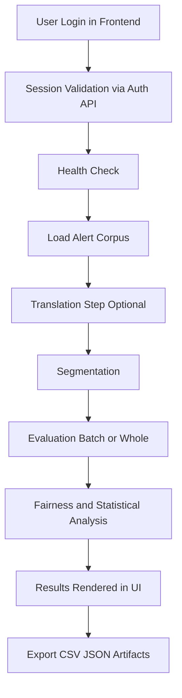

# IPAWS App: End-to-End Guide for PhD Researchers

## Purpose
This guide explains how to use the IPAWS app as a research platform to study emergency alert language, translation quality, segmentation behavior, and fairness-related evaluation outcomes.

The goal is to move from raw alert text to reproducible analytical outputs suitable for thesis chapters, conference papers, or audit-ready appendices.

## How the application works
At a high level, the application has three layers:

1. **Frontend (React app):** where you log in, load alerts, run translation/evaluation actions, and view results.
2. **Backend API (FastAPI):** validates sessions, receives each action from the UI, and routes work to research modules.
3. **Research pipeline modules:** perform translation, segmentation, scoring, aggregation, and statistical/fairness analysis, then return structured outputs.

For each run, the flow is:
- You initiate an action in the UI (for example translate, segment, evaluate, or analyze).
- The UI sends a request to the backend endpoint with your current context.
- The backend executes the relevant pipeline step(s) and collects artifacts.
- Results are returned to the UI for inspection and can be exported as CSV/JSON.

This means the UI is the control surface, while the backend and pipeline are the computation engine. Health checks confirm the engine is available before you start collecting results.

## Intended audience
- PhD students and postdoctoral researchers
- Computational social science and NLP researchers
- Supervisors reviewing methodology and validity

## End-to-end research workflow

### 1) Define your research question and protocol
- State your hypotheses before running analysis (for example: translation quality differences by alert type).
- Decide whether your unit of analysis is whole alert text or segmented units.
- Predefine inclusion/exclusion criteria for alerts.

Research output: a documented protocol that reduces hindsight bias.

### 2) Authenticate and verify environment readiness
- Sign in with Google using an account authorized on the backend allowlist (your role and evaluation language are assigned automatically).
- Confirm system readiness in the Health view before collecting results.
- Record environment details (date, app version/deployment target, model/provider settings).

Research output: a traceable run context for reproducibility.

### 3) Ingest and curate alert corpus
- Load single or batch alerts in the Alerts pane.
- Navigate alerts using Back/Next and confirm each sample meets your protocol.
- Use the collapsible pane to preserve context while reviewing content.

Research output: a curated dataset aligned with your sampling frame.

### 4) Execute translation pipeline (if multilingual study)
- Run translation with your selected provider/model configuration.
- Keep provider and model fixed within a study condition.
- Note any failed or partial translations as explicit exclusions or error strata.

Research output: standardized translated corpus with known configuration.

### 5) Run segmentation and inspect unit boundaries
- Segment alerts into smaller analytical units.
- Verify whether boundaries preserve semantic coherence for your task.
- Use a consistent segmentation policy across experiments.

Research output: consistent analysis units for cross-sample comparison.

### 6) Perform evaluations (Batch or Whole)
- Use Batch mode for high-throughput experimental runs.
- Use Whole mode when contextual coherence of full messages matters.
- Apply compare mode where relevant to inspect condition differences.

Research output: structured scores for inferential and descriptive analysis.

### 7) Analyze fairness and statistical patterns
- Review fairness-oriented summaries and distribution outputs.
- Inspect aggregate trends, outliers, and subgroup differences.
- Distinguish exploratory findings from confirmatory tests in reporting.

Research output: defensible interpretation of quality/fairness metrics.

### 8) Export artifacts for reproducible reporting
- Export generated CSV/JSON outputs for downstream analysis.
- Preserve run metadata, exclusions, and parameter settings with each export.
- Version outputs by experiment ID or timestamp.

Research output: reproducible artifact set for manuscripts and appendices.

## How each step works (technical walkthrough)

### Step 1: Authentication
- **User action:** sign in with Google (Firebase Auth popup).
- **Backend action:** `POST /auth/google` verifies the Google ID token, checks the email allowlist, assigns role/language, and creates a token with TTL.
- **System state change:** session token is cached server-side; token and expiry are returned.
- **Success output:** authenticated session available for protected routes.
- **Failure modes:** unverified email or non-allowlisted account (`401`/`403`); expired/invalid token on later calls (`401`).

### Step 2: Session validation and readiness
- **User action:** app loads or refreshes.
- **Backend action:** `GET /auth/session` verifies bearer token and expiry.
- **System state change:** expired sessions are dropped from in-memory session store.
- **Success output:** user remains in app and can access role-allowed pages.
- **Failure modes:** token missing/expired leads to login gate.

### Step 3: Health verification
- **User action:** open health view before running experiments.
- **Backend action:** `GET /health` returns service status and timestamp.
- **System state change:** none (read-only check).
- **Success output:** confirms API is reachable and responsive.
- **Failure modes:** unavailable service means results should not be collected.

### Step 4: Alert ingestion
- **User action:** load a sample or batch in Alerts.
- **Backend action:** `GET /alerts` retrieves and normalizes alert records with selected filters.
- **System state change:** selected alerts are held in frontend state for iteration.
- **Success output:** curated corpus ready for translation/evaluation.
- **Failure modes:** upstream data unavailability or empty filtered sample.

### Step 5: Translation
- **User action:** run translation for active message(s).
- **Backend action:** `POST /translate` dispatches to configured translation system (`gpt4o`, `gpt5.5`, `google_nmt`, `llama3`).
- **System state change:** translated text is attached to the active analysis context.
- **Success output:** translated content available for downstream scoring.
- **Failure modes:** credential/provider/model errors; partial translation outputs.

### Step 6: Segmentation
- **User action:** request segmentation for source or translated text.
- **Backend action:** `POST /segment` generates segment boundaries and labels.
- **System state change:** segmented units replace or augment full-text review state.
- **Success output:** analyzable units for consistent comparison.
- **Failure modes:** malformed/empty text yields low-quality or empty segments.

### Step 7: Automated evaluation
- **User action:** run scoring in Single/Batch/Whole workflows.
- **Backend action:** `POST /evaluate` computes fairness/quality-related scores.
- **System state change:** score payload is stored in current UI run state.
- **Success output:** structured metrics for aggregate analysis and interpretation.
- **Failure modes:** missing source/translation context or incompatible payload fields.

### Step 8: Human evaluation capture
- **User action:** submit manual scores and rationale.
- **Backend action:** `POST /evaluate/human` appends submission rows to persisted CSV (evaluator identity taken from the signed-in session).
- **System state change:** `outputs/human_fairness_scores.csv` gains new records.
- **Success output:** auditable human-judgment dataset for triangulation.
- **Failure modes:** invalid form values or write failures.

### Step 8b: Review and revise submissions
- **User action:** open the **My Submissions** page to review saved evaluations.
- **Backend action:** `GET /submissions` returns your rows (admins see all); `PUT`/`DELETE /submissions/{id}` edit or remove a row.
- **System state change:** `outputs/human_fairness_scores.csv` is rewritten on edit/delete.
- **Success output:** corrected, self-managed evaluation record.
- **Failure modes:** editing another user's row is rejected (`403`); missing row (`404`).

### Step 9: Statistical/fairness aggregation
- **User action:** open analytics views or run full pipeline.
- **Backend action:** `GET /admin/analysis` and/or `POST /pipeline/run` aggregates scores, computes summary statistics, and prepares analysis artifacts.
- **System state change:** dashboard-ready data and derived results are produced.
- **Success output:** trends, distributions, comparisons, and inferential results.
- **Failure modes:** missing source files or insufficient sample size for specific tests.

### Step 10: Export and reproducibility packaging
- **User action:** export outputs for offline analysis/reporting.
- **Backend action:** pipeline/export utilities write CSV/JSON artifacts to `outputs/`.
- **System state change:** versioned result files become available for downstream notebooks or manuscripts.
- **Success output:** portable dataset + analysis artifacts.
- **Failure modes:** partial run artifacts if upstream steps were skipped or failed.

## Recommended research rigor checklist
- **Pre-registration discipline:** hypotheses and metrics defined before analysis.
- **Configuration control:** fixed model/provider per condition.
- **Data provenance:** source alerts and filtering criteria recorded.
- **Error accounting:** failed runs documented, not silently dropped.
- **Replication:** rerun subset to confirm stability of outcomes.

## Typical PhD use cases
- **Cross-lingual robustness:** compare evaluation behavior before/after translation.
- **Message quality research:** test clarity and consistency across alert categories.
- **Fairness diagnostics:** detect systematic score differences across subgroups.
- **Method comparison:** compare segmentation/evaluation settings under shared data.

## Threats to validity and mitigation
- **Selection bias:** use explicit sampling rules and report exclusions.
- **Model drift:** capture model/provider settings and run windows.
- **Measurement ambiguity:** define construct-to-metric mapping in advance.
- **Pipeline failures:** keep health checks and failure logs with results.

## Practical troubleshooting for research runs
- **Login failure:** confirm your Google account is authorized on the backend allowlist and that the session is valid.
- **Health not OK:** stop data collection and re-run only after service recovery.
- **Translation errors:** verify provider credentials and provider-specific limits.
- **Missing outputs:** rerun affected alerts and annotate rerun criteria.

## Expected deliverables from an end-to-end run
- A curated alert corpus (with documented criteria)
- Translation/segmentation/evaluation outputs
- Fairness/statistical summaries
- Reproducibility notes (config + run metadata)
- Export package suitable for publication supplements
